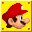

# Super Mario Sound Pad 

[Sound FX](http://www.mariomayhem.com/downloads/sounds/super_mario_bros_nes_sounds.php)
and
[Music](http://www.mariomayhem.com/downloads/sound_tracks/super_mario_bros_1_soundtrack.php) sources.

###### TODO:
1. Sound Pad Grid
2. Sound Pad Looper
3. Sound Pad Logs
4. Custom Key Mappings
5. Customized Sounds

